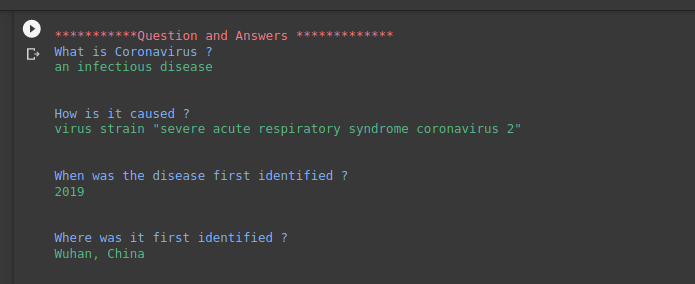
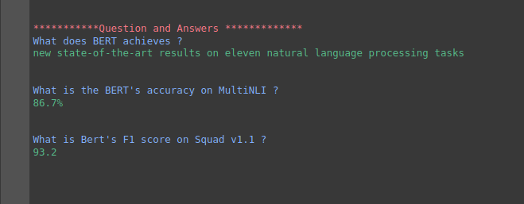

### Flask App for question and answering using BERT finetuned on Squad-2.0 dataset 

### BERT (Bidirectional Encoder Representations from Transformations)
It is based on the concept of TRANSFORMER - Self Attention. It has various transformer layer stacked over one other.
BERT base has L=12 layers and hidden size 768 whereas BERT Large has L=24 layers and hidden size=1024. It has an identical model as OpenAI GPT, with only difference that BERT uses Bidirectional self attention layers and which has really made a big difference.

Here the BERT-BASE model **(12 layers)** was fine tuned on **Squad-2.0** dataset.
To know more about **Squad2.0** dataset click [here](https://rajpurkar.github.io/SQuAD-explorer/)


Dependencies :
```python

pip install pytorch-pretrained-bert
pip install Flask

```


### Inference

#### Test on batches :
> - Modify **Input_file.txt**
> - Run **Code/Test_Bert.ipynb**

#### Test on single instance :
> - **test.py**

### RESULT 
> **Input Para :**
> 1. Coronavirus disease 2019 (COVID-19) is an infectious disease caused by the virus strain "severe acute respiratory syndrome coronavirus 2" (SARS-CoV-2).The disease was first identified in 2019 in Wuhan, China, and has since spread globally, resulting in the 2019–20 coronavirus pandemic.Common symptoms include fever, cough, and shortness of breath. Muscle pain, sputum production and sore throat are less common.While the majority of cases result in mild symptoms,some progress to severe pneumonia and multi-organ failure.As of 20 March 2020, the rate of deaths per number of diagnosed cases is 4.1%, but ranges from 0.2% to 15% depending on age and other health problems.
>
> > **Output :**
>
> > 
>
> 2. BERT is conceptually simple and empirically powerful. It obtains new state-of-the-art results on eleven natural language processing tasks, including pushing the GLUE benchmark to 80.4% (7.6% absolute improvement), MultiNLI accuracy to 86.7% (5.6% absolute improvement) and the SQuAD v1.1 question answering Test F1 to 93.2 (1.5 absolute improvement), outperforming human performance by 2.0.
>
> > **Output :**
>
> > 
>

### Run Flask App :
```
python bert_app.py
```
